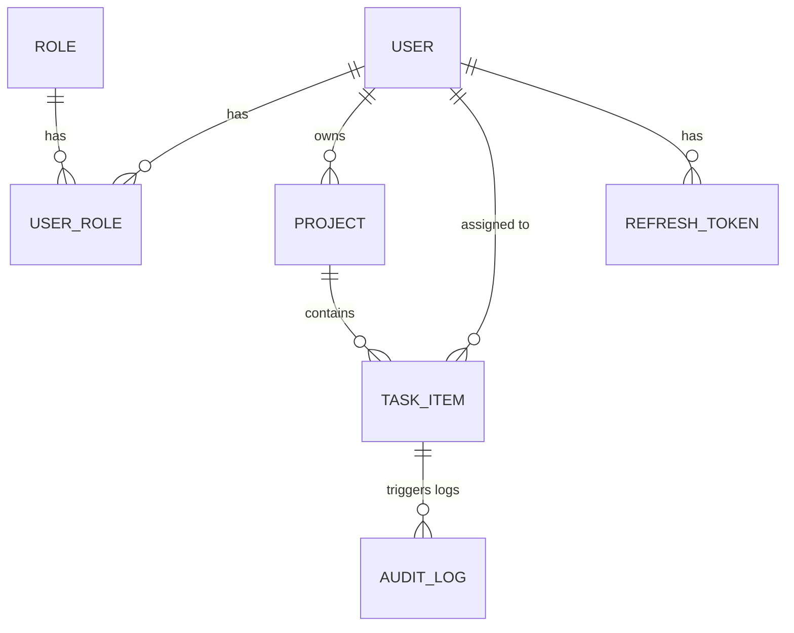
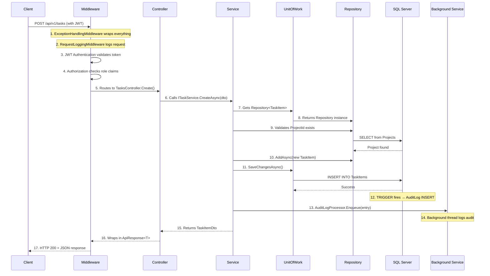

# 🔨 TaskForge — Complete Project Structure & Flow Walkthrough

A .NET 8 Web API built with **Clean Architecture** for enterprise Task & Project Management. Below is every folder, file, and the complete request flow explained.

---

## 📂 Top-Level Structure

```
TaskForge/
├── TaskForge.sln              ← Solution file (links all 4 projects)
├── README.md                  ← Documentation
├── WALKTHROUGH.md             ← This file
├── src/                       ← All source code (4 Clean Architecture layers)
│   ├── TaskForge.Domain/      ← Layer 1: Core business entities & contracts
│   ├── TaskForge.Application/ ← Layer 2: DTOs & service interfaces
│   ├── TaskForge.Infrastructure/ ← Layer 3: Implementations (DB, Auth, etc.)
│   └── TaskForge.API/         ← Layer 4: HTTP entry point (controllers, middleware)
├── sql/                       ← Database setup scripts
└── postman/                   ← API testing collection
```

### Dependency Rule (innermost → outermost)
```
Domain ← Application ← Infrastructure ← API
```
- **Domain** depends on nothing (pure C#)
- **Application** depends only on Domain
- **Infrastructure** depends on Domain + Application
- **API** depends on all three (it's the composition root)

---

## 🧩 Layer 1: `TaskForge.Domain/` — The Core

> **Purpose**: Pure business objects. ZERO dependency on frameworks, databases, or HTTP. This is the "heart" of the app.

### `Entities/` — Database Table Models

| File | What It Represents | Key Fields |
|------|-------------------|------------|
| `User.cs` | A user account | `Id`, `Username`, `Email`, `PasswordHash`, `FirstName`, `LastName`, `Status` |
| `Role.cs` | A permission role (Admin/User) | `Id`, `Name`, `Description` |
| `UserRole.cs` | Many-to-many join table `User ↔ Role` | `UserId`, `RoleId`, `AssignedAt` |
| `Project.cs` | A project container | `Id`, `Name`, `Description`, `OwnerId`, `IsActive` |
| `TaskItem.cs` | An individual task within a project | `Id`, `Title`, `Status`, `Priority`, `DueDate`, `ProjectId`, `AssignedToId` |
| `AuditLog.cs` | Change history log (auto-populated by DB triggers) | `EntityName`, `EntityId`, `Action`, `OldValues`, `NewValues` |
| `RefreshToken.cs` | JWT refresh token storage | `Token`, `UserId`, `ExpiresAt`, `RevokedAt` |

### Entity Relationships


### `Enums/` — Status & Priority Constants

`Enums.cs` defines:
- **`TaskItemStatus`**: `Pending` → `InProgress` → `Completed` / `OnHold` / `Cancelled`
- **`TaskPriority`**: `Low`, `Medium`, `High`, `Critical`
- **`UserStatus`**: `Active`, `Inactive`, `Suspended`

### `Interfaces/` — Contracts (No Implementation Here!)

| File | What It Defines | Why It Exists |
|------|----------------|---------------|
| `IRepository.cs` | Generic CRUD operations (`GetByIdAsync`, `AddAsync`, `FindAsync`, `Query`, etc.) | So services never depend on EF Core directly |
| `IUnitOfWork.cs` | Transaction management (`SaveChangesAsync`, `BeginTransactionAsync`, `CommitTransactionAsync`) | Groups multiple repo operations into one transaction |
| `IStoredProcedureExecutor.cs` | Raw ADO.NET stored procedure execution | For complex SQL queries that EF Core can't handle efficiently |

---

## 📋 Layer 2: `TaskForge.Application/` — Contracts & Data Shapes

> **Purpose**: Defines WHAT the app can do (interfaces) and HOW data moves between layers (DTOs). Contains NO implementation code.

### `DTOs/` — Data Transfer Objects

`DTOs.cs` contains all request/response models organized by feature:

| Category | Classes | Purpose |
|----------|---------|---------|
| **Common** | `PagedResult<T>`, `ApiResponse<T>` | Standardized API response wrapper & pagination |
| **Auth** | `LoginRequest`, `RegisterRequest`, `AuthResponse`, `RefreshTokenRequest` | Authentication I/O |
| **User** | `UserDto`, `CreateUserRequest`, `UpdateUserRequest` | User CRUD I/O |
| **Role** | `RoleDto`, `CreateRoleRequest` | Role management I/O |
| **Project** | `ProjectDto`, `CreateProjectRequest`, `UpdateProjectRequest` | Project CRUD I/O |
| **Task** | `TaskItemDto`, `CreateTaskRequest`, `UpdateTaskRequest`, `BulkUpdateTaskStatusRequest` | Task CRUD + bulk ops I/O |
| **Report** | `TaskSummaryReport`, `ProjectTaskReport`, `UserProductivityReport` | Analytics/reporting I/O |
| **Audit** | `AuditLogDto` | Audit log display |

### `Interfaces/` — Service Contracts

`IServices.cs` defines 7 service interfaces:

| Interface | Methods | Feature Area |
|-----------|---------|-------------|
| `IAuthService` | `LoginAsync`, `RegisterAsync`, `RefreshTokenAsync`, `RevokeTokenAsync`, `ValidateBasicAuthAsync` | Authentication |
| `IUserService` | `GetByIdAsync`, `GetAllAsync`, `CreateAsync`, `UpdateAsync`, `DeleteAsync`, `AssignRoleAsync`, `RemoveRoleAsync` | User management |
| `IRoleService` | `GetByIdAsync`, `GetAllAsync`, `CreateAsync`, `DeleteAsync` | Role management |
| `IProjectService` | `GetByIdAsync`, `GetAllAsync`, `CreateAsync`, `UpdateAsync`, `DeleteAsync` | Project management |
| `ITaskService` | `GetByIdAsync`, `GetAllAsync`, `CreateAsync`, `UpdateAsync`, `DeleteAsync`, `BulkUpdateStatusAsync`, `GetByUserAsync` | Task management |
| `IReportService` | `GetTaskSummaryAsync`, `GetProjectTaskReportsAsync`, `GetUserProductivityAsync` | Analytics |
| `ICacheService` | `Get<T>`, `Set<T>`, `Remove` | In-memory caching |

---

## ⚙️ Layer 3: `TaskForge.Infrastructure/` — The Implementations

> **Purpose**: All "external" concerns live here — database access, authentication logic, caching, background jobs. This is where the actual work happens.

### `Data/` — Database Layer

| File | What It Does |
|------|-------------|
| `AppDbContext.cs` | EF Core DbContext — defines all `DbSet<>` properties, configures table mappings, column lengths, indexes, relationships via Fluent API in `OnModelCreating`. Seeds default "Admin" & "User" roles. |
| `StoredProcedureExecutor.cs` | Raw ADO.NET execution of SQL stored procedures — bypasses EF Core for complex analytics queries. Implements `IStoredProcedureExecutor`. |

### `Repositories/` — Data Access Pattern

| File | What It Does |
|------|-------------|
| `Repository.cs` | Generic `Repository<T>` — wraps EF Core's `DbSet<T>` to provide `GetByIdAsync`, `AddAsync`, `FindAsync`, `Query()`, etc. |
| `UnitOfWork.cs` | Manages transactions across repositories. Uses `ConcurrentDictionary` to cache repository instances for performance. |

### `Auth/` — Authentication

| File | What It Does |
|------|-------------|
| `JwtTokenProvider.cs` | Generates JWT access tokens (with user claims: `userId`, `username`, roles) and random refresh tokens. |
| `BasicAuthenticationHandler.cs` | Handles `Authorization: Basic base64(user:pass)` header — decodes, validates credentials via `IAuthService`. |

### `Services/` — Business Logic

| File | Implements | What It Does |
|------|-----------|-------------|
| `AuthService.cs` | `IAuthService` | Login (validates password via BCrypt, generates JWT), Register (hashes password, assigns "User" role), Refresh (token rotation), Revoke (logout), Basic Auth validation |
| `UserService.cs` | `IUserService` | CRUD for users, assign/remove roles, paginated listing |
| `RoleService.cs` | `IRoleService` | CRUD for roles |
| `ProjectService.cs` | `IProjectService` | CRUD for projects with caching via `ICacheService` |
| `TaskService.cs` | `ITaskService` | CRUD for tasks, bulk status updates (uses `Parallel.ForEachAsync` + `SemaphoreSlim`), filtering, pagination |
| `ReportService.cs` | `IReportService` | Executes stored procedures via `IStoredProcedureExecutor` for analytics: task summaries, per-project reports, user productivity rankings |
| `CacheService.cs` | `ICacheService` | Wrapper over `IMemoryCache` with configurable TTL |

### `BackgroundServices/` — Long-Running Jobs

`BackgroundServices.cs` contains:

| Class | What It Does |
|-------|-------------|
| `AuditLogProcessor` | Runs in background, drains a `ConcurrentQueue<AuditLogEntry>` every 5 seconds, logs audit actions. Thread-safe producer-consumer pattern. |
| `TaskNotificationService` | Background service that checks for overdue tasks every 60 seconds (placeholder for notification logic). |

---

## 🌐 Layer 4: `TaskForge.API/` — HTTP Entry Point

> **Purpose**: Handles HTTP requests/responses, routes to services, configures everything via DI. This is where the app starts.

### `Controllers/V1/` — API Endpoints

All controllers use API versioning: `api/v{version}/[controller]`

| File | Routes | Auth Required | Key Operations |
|------|--------|--------------|----------------|
| `AuthController.cs` | `POST /auth/register`, `/login`, `/refresh`, `/revoke` | Public (except revoke) | Register, Login, Token Refresh, Logout |
| `UsersController.cs` | `GET/POST/PUT/DELETE /users` | JWT (Admin for create/delete) | CRUD + role assignment |
| `RolesController.cs` | `GET/POST/DELETE /roles` | JWT (Admin for create/delete) | Role management |
| `ProjectsController.cs` | `GET/POST/PUT/DELETE /projects` | JWT (Admin for delete) | Project CRUD |
| `TasksController.cs` | `GET/POST/PUT/DELETE /tasks`, `PATCH /tasks/bulk-update-status` | JWT (Admin for delete/bulk) | Task CRUD + bulk operations |
| `ReportsController.cs` | `GET /reports/task-summary`, `/project-tasks`, `/user-productivity` | JWT (Admin for productivity) | Analytics via stored procedures |

### `Middleware/` — Request Pipeline

`Middleware.cs` contains:

| Class | What It Does |
|-------|-------------|
| `ExceptionHandlingMiddleware` | Catches ALL unhandled exceptions → maps them to proper HTTP status codes → returns standardized `ProblemDetails` JSON |
| `RequestLoggingMiddleware` | Logs every request/response with method, path, status code, and duration in milliseconds |

### `Program.cs` — The Composition Root

Wires everything together:

1. **Serilog** — Console + daily rolling file logging
2. **EF Core** — SQL Server connection with retry & timeout
3. **DI Registration** — All repositories, services, auth providers
4. **JWT Auth** — Token validation parameters (issuer, audience, signing key)
5. **Basic Auth** — Registered as secondary auth scheme
6. **API Versioning** — URL-segment based (`/api/v1/...`)
7. **Swagger** — OpenAPI docs with JWT Bearer UI support
8. **Background Services** — `AuditLogProcessor` + `TaskNotificationService`
9. **CORS** — Wide open for development
10. **Middleware Pipeline** — Exception handling → Request logging → HTTPS → CORS → Auth → Controllers

---

## 🗄️ `sql/` — Database Scripts

Run these **in order** against SQL Server:

| File | What It Creates |
|------|----------------|
| `01_CreateDatabase.sql` | Database `TaskForgeDB` + all tables (`Users`, `Roles`, `UserRoles`, `Projects`, `TaskItems`, `AuditLogs`, `RefreshTokens`) |
| `02_StoredProcedures.sql` | 8 stored procedures (task summary, project reports, user productivity with CTEs + Window Functions + Temp Tables) |
| `03_Triggers.sql` | `AFTER INSERT/UPDATE/DELETE` triggers on `TaskItems` → auto-populates `AuditLogs` |
| `04_Indexes.sql` | Composite, covering, and filtered indexes for query optimization |
| `05_SeedData.sql` | Sample data: roles, admin user, test projects, and tasks |

---

## 📮 `postman/` — API Testing

`TaskForge.postman_collection.json` — Pre-built Postman collection with all endpoints. Auto-saves JWT tokens from login/register so you don't have to copy-paste them.

---

## 🔄 Complete Project Flow — How a Request Travels

Here's what happens step-by-step when you call `POST /api/v1/tasks` to create a task:



### Step-by-Step Breakdown

| Step | Layer | What Happens |
|------|-------|-------------|
| **1-2** | `Middleware/` | `ExceptionHandlingMiddleware` wraps the entire pipeline in try/catch. `RequestLoggingMiddleware` logs `→ POST /api/v1/tasks` |
| **3-4** | `Program.cs` (Auth) | JWT token is parsed, validated (signature, expiry, issuer). Claims (`userId`, roles) are extracted. `[Authorize]` checks if the user has the required role. |
| **5** | `TasksController.cs` | ASP.NET routing matches `POST /tasks` → `TasksController.Create()`. Controller receives `CreateTaskRequest` DTO from request body. |
| **6** | Controller → Service | Controller calls `_taskService.CreateAsync(request)` — controller has NO business logic, just delegates. |
| **7-8** | Service → Repository | `TaskService` asks `IUnitOfWork` for `IRepository<TaskItem>`. UnitOfWork creates or returns a cached `Repository<TaskItem>`. |
| **9** | Repository → DB | Service validates the `ProjectId` exists by querying `Repository<Project>`. |
| **10-11** | Repository → DB | `Repository.AddAsync()` adds entity to EF Core change tracker. `UnitOfWork.SaveChangesAsync()` flushes all changes to SQL Server in one transaction. |
| **12** | SQL Server | The DB trigger on `TaskItems` table fires, automatically inserting a row into `AuditLogs` with the action details. |
| **13-14** | `BackgroundServices/` | `AuditLogProcessor.Enqueue()` adds an entry to the `ConcurrentQueue`. The background thread picks it up within 5 seconds and logs it. |
| **15-16** | Service → Controller | Service maps the entity back to `TaskItemDto` and returns it. Controller wraps it in `ApiResponse<TaskItemDto>.Ok()`. |
| **17** | Middleware | Response passes back through middleware. `RequestLoggingMiddleware` logs `← 200 in 45ms`. |

### Authentication Flow (Login)

```
1. Client sends POST /auth/login { username, password }
2. AuthController → AuthService.LoginAsync()
3. AuthService queries User by username (with roles eager-loaded)
4. BCrypt.Verify(password, storedHash) — password check
5. JwtTokenProvider.GenerateAccessToken() — creates JWT with claims
6. JwtTokenProvider.GenerateRefreshToken() — creates random refresh token
7. Refresh token saved to DB (RefreshTokens table)
8. Returns { accessToken, refreshToken, expiresAt, user }
```

### Authentication Flow (Token Refresh)

```
1. Client sends POST /auth/refresh { refreshToken }
2. AuthService looks up token in DB
3. Validates it's not revoked and not expired
4. REVOKES old token (rotation for security)
5. Generates NEW access + refresh tokens
6. Saves new refresh token to DB
7. Returns new tokens to client
```

---

## 🏗️ Design Patterns Used

| Pattern | Where | Purpose |
|---------|-------|---------|
| **Clean Architecture** | All 4 projects | Separation of concerns, testability |
| **Repository Pattern** | `IRepository<T>` / `Repository<T>` | Abstracts data access from business logic |
| **Unit of Work** | `IUnitOfWork` / `UnitOfWork` | Transaction management across repos |
| **Dependency Injection** | `Program.cs` | Loose coupling, interface-based programming |
| **DTO Pattern** | `DTOs.cs` | Prevents entity exposure to API consumers |
| **Middleware Pipeline** | `Middleware.cs` | Cross-cutting concerns (logging, errors) |
| **Background Service** | `BackgroundServices.cs` | Async audit processing, notifications |
| **Producer-Consumer** | `ConcurrentQueue` in `AuditLogProcessor` | Thread-safe async message passing |
| **Token Rotation** | `AuthService.RefreshTokenAsync` | Security: old refresh tokens are invalidated |
